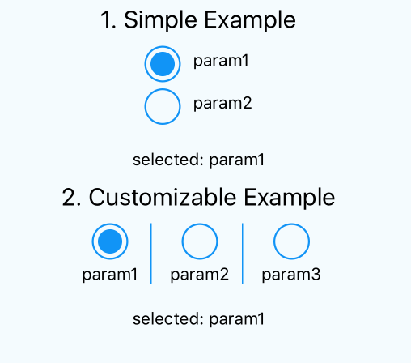
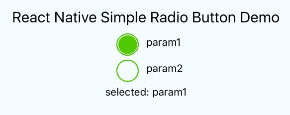
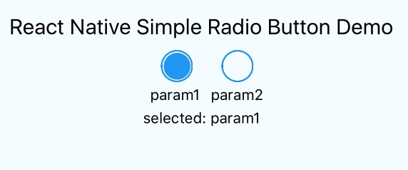
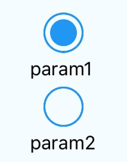
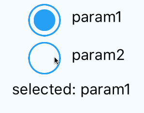

# react-native-simple-radio-button
> simple and useful radio button component for React Native

[]()[]()

[](https://nodei.co/npm/react-native-simple-radio-button/)


Demo
---




## Installation

in Cli

```sh
npm i react-native-simple-radio-button --save
```


# Getting started

```js
import RadioForm, {RadioButton, RadioButtonInput, RadioButtonLabel} from 'react-native-simple-radio-button';


var radio_props = [
  {label: 'param1', value: 0 },
  {label: 'param2', value: 1 }
];

var RadioButtonProject = React.createClass({
  getInitialState: function() {
    return {
      value: 0,
    }
  },
  render: function() {
    return (
      <View>
        <RadioForm
          radio_props={radio_props}
          initial={0}
          onPress={(value) => {this.setState({value:value})}}
        />
      </View>
    );
  }
});
```

Basic
---

```js
<RadioForm
  radio_props={radio_props}
  initial={0}
  onPress={(value) => {this.setState({value:value})}}
/>
```

Advanced
---

```js
<RadioForm
  radio_props={this.state.types}
  initial={0}
  formHorizontal={false}
  labelHorizontal={true}
  buttonColor={'#2196f3'}
  animation={true}
  onPress={(value) => {this.setState({value:value})}}
/>
```

Pro
---

```js
<RadioForm
  formHorizontal={true}
  animation={true}
>
  {/* To create radio buttons, loop through your array of options */}
  {radio_props.map((obj, i) => {
    <RadioButton labelHorizontal={true} key={i} >
      {/*  You can set RadioButtonLabel before RadioButtonInput */}
      <RadioButtonInput
        obj={obj}
        index={i}
        isSelected={this.state.value3Index === i}
        onPress={onPress}
        borderWidth={1}
        buttonInnerColor={'#e74c3c'}
        buttonOuterColor={this.state.value3Index === i ? '#2196f3' : '#000'}
        buttonSize={40}
        buttonOuterSize={80}
        buttonStyle={{}}
        buttonWrapStyle={{marginLeft: 10}}
      />
      <RadioButtonLabel
        obj={obj}
        index={i}
        labelHorizontal={true}
        onPress={onPress}
        labelStyle={{fontSize: 20, color: '#2ecc71'}}
        labelWrapStyle={{}}
      />
      </RadioButton>
  })}
  
</RadioForm>
```

# Methods

## updateIsActiveIndex
Updating active radio button forcibly

# Props

## RadioForm Component
### radio_props (Default: `[]`) _*required_
radio button value and label array

### onPress _*required_
callback when radio button clicked.

### initial (Default: `0`)
The index of selected radio button. This is used when this component is activated. If you want to
pass initial as asynchronous, you can use updateIsActiveIndex function.
> If you want to make it empty initially, please pass `-1`

### buttonColor(Default: '#2196f3')
change radio button color

```js
<RadioForm
  radio_props={radio_props}
  initial={0}
  buttonColor={'#50C900'}
/>
```



### labelColor(Default: '#000')
change label color

```js
<RadioForm
  radio_props={radio_props}
  initial={0}
  labelColor={'#50C900'}
/>
```


### formHorizontal(Default: false)
change form position

```js
<RadioForm
  radio_props={radio_props}
  initial={0}
  formHorizontal={true}
/>
```




### labelHorizontal(Default: true)
change label position

```js
<RadioForm
  radio_props={radio_props}
  initial={0}
  labelHorizontal={false}
/>
```



### animation (Default: `true`)
if you pass false, animation of radio button is disabled



### accessible
indicates accessibility for the individual radio button input and radio button label components

### accessibilityLabel
used to set accessibilityLabel for individual radio button input and radio button label components,
radio button input will have accessibilityLabel = [accessibilityLabel]Input[index]
radio button label will have accessibilityLabel = [accessibilityLabel]Label[index]

### testID
used to set testID for individual radio button input and radio button label components,
radio button input will have testID = [testID]Input[index]
radio button label will have testID = [testID]Label[index]

## RadioButton Component
### isSelected
If you pass `true` to this param, that button change to selected status.

### labelHorizontal
change label position to horizontal

### buttonColor
The button color

### selectedButtonColor
The selected button color

### labelColor
The label color

### style
The label style

### wrapStyle
Styles that are applied to the <View> wrapping the RadioButton component.

## onPress _*required_
callback when radio button clicked.

### idSeparator (Default: `|`)
separator used for extracting id from accessibilityLabel and testID

### accessible
indicates accessibility for the wrapped radio button input and radio button label components

### accessibilityLabel
used to set accessibilityLabel for the wrapped radio button input and radio button label components, needs to be of the format [accessibilityLabel][separator][id]
radio button input will have accessibilityLabel = [accessibilityLabel]Input[index]
radio button label will have accessibilityLabel = [accessibilityLabel]Label[index]

### testID
used to set testID for individual radio button input and radio button label components, needs to be of the format [testID][separator][id]
radio button input will have testID = [testID]Input[index]
radio button label will have testID = [testID]Label[index]

```js
<RadioButton
  accessible={true}
  idSeparator=','
  accessibilityLabel='noteType,1'
  testID='noteType,1'
/>
```

# RadioButtonInput
### isSelected
### onPress
### buttonInnerColor
The button inner color

### buttonOuterColor
The button inner color

### buttonSize
The button size. Width and height will be same length.

### buttonOuterSize
The button size of outer. Width and height will be same length.

### buttonStyle
Custom button style

### buttonWrapStyle
Custom style for view of button's outside

### accessible
indicates accessibility for the radio button input component

### accessibilityLabel
used to set accessibilityLabel (content description / label for Android) for the radio button input component

### testID
used to set testID (id / name for iOS) for the radio button input component

# RadioButtonLabel
### labelHorizontal
If you pass true, the button and label will be aligned horizontally.

### labelStyle
If you pass style, you can change label text style as you want

### labelWrapStyle
If you pass style, you can change label wrapper view style as you want

### onPress _*required_
callback when radio button clicked.

### accessible
indicates accessibility for the radio button label component

### accessibilityLabel
used to set accessibilityLabel (content description / label for Android) for the radio button label component

### testID
used to set testID (id / name for iOS) for the radio button label component


# Contributing
Of course! Welcome :)

You can use following command in `example` dir:

```
npm run sync
```

During running this command, when you change source to implement/fix something, these changes will sync to `example/node_modules/react-native-simple-radio-button/`. You can check your change using example project easily.


# License
MIT
