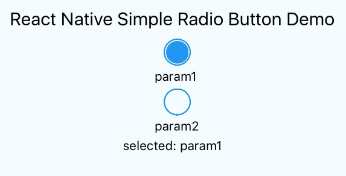

# react-native-simple-radio-button
simple and useful radio button component for React Native

[](https://nodei.co/npm/react-native-simple-radio-button/)


# Installation

in Cli

```
npm i react-native-simple-radio-button
```

in JavaScirpt

```
import Radio from 'react-native-simple-radio-button';
```


# Usage

```
var radio_props = [
  {
    label: 'param1',
    value: 0
  },
  {
    label: 'param2',
    value: 1
  }
];

var RadioButtonProject = React.createClass({
  getInitialState: function() {
    return {
      value: 0,
    }
  },
  render: function() {
    return (
      <View>
        <Radio
          radio_props={radio_props}
          initial={0}
          onPress={(value) => {this.setState({value:value})}}
        />
      </View>
    );
  }
});
```


# Props

## buttonColor(Default: '#2196f3')
change radio button color 

```
<Radio
  radio_props={radio_props}
  initial={0}
  buttonColor={'#50C900'}
/>
```


## formHoriozntal(Default: false)
change form position

```
<Radio
  radio_props={radio_props}
  initial={0}
  formHoriozntal={true}
/>
```


## labelHoriozntal(Default: true)
change label position

```
<Radio
  radio_props={radio_props}
  initial={0}
  labelHoriozntal={false}
/>
```




# Contributing
Welcome :)


# License
MIT


